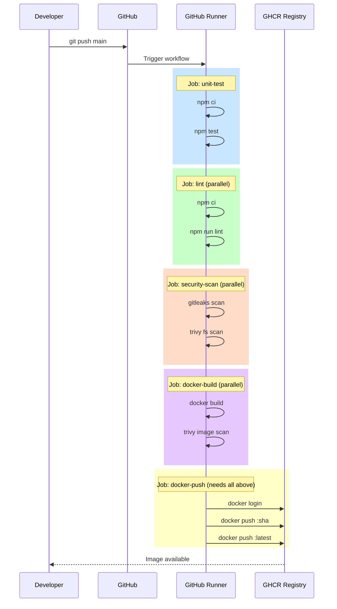
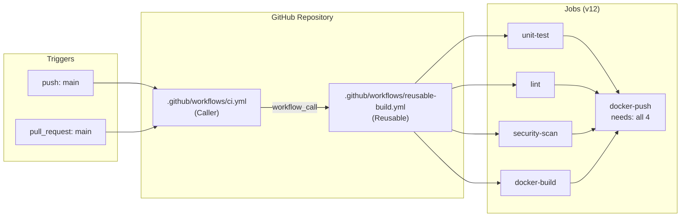

# Kiến Trúc Hệ Thống — CI Training Lab

## Kiến trúc ứng dụng

```mermaid
graph TB
    subgraph Client ["Client (curl / browser)"]
        C[HTTP Request]
    end

    subgraph App ["Express Application (src/)"]
        A[app.js<br/>Express Server<br/>PORT 3000]
        R[routes/api.js<br/>Router]
        S[services/mathService.js<br/>Business Logic]
        CFG[config.js<br/>Environment Config]
    end

    subgraph Endpoints ["API Endpoints"]
        H[GET /health]
        ADD[GET /add?a=&b=]
        DIV[GET /divide?a=&b=]
    end

    C -->|HTTP GET| A
    A --> R
    R --> H
    R --> ADD
    R --> DIV
    ADD -->|add a, b| S
    DIV -->|divide a, b| S
    A --> CFG

    H -->|{"status":"ok"}| C
    ADD -->|3| C
    DIV -->|5| C
```

---

## Luồng GitHub Actions



---

## Cấu trúc GitHub Actions



---

## Caching Flow

```mermaid
flowchart TD
    Start[Pipeline Start] --> Check{Cache exists?<br/>key=hash(package-lock.json)}
    
    Check -->|Cache HIT| Restore[Restore cache<br/>~2 seconds]
    Check -->|Cache MISS| Fresh[npm ci from internet<br/>~45 seconds]
    
    Restore --> Install[npm ci<br/>~3 seconds]
    Fresh --> Save[Save cache for next run]
    
    Install --> Run[Run tests/lint]
    Save --> Run
    
    style Restore fill:#4CAF50,color:#fff
    style Fresh fill:#FF9800,color:#fff
    style Save fill:#2196F3,color:#fff
```
