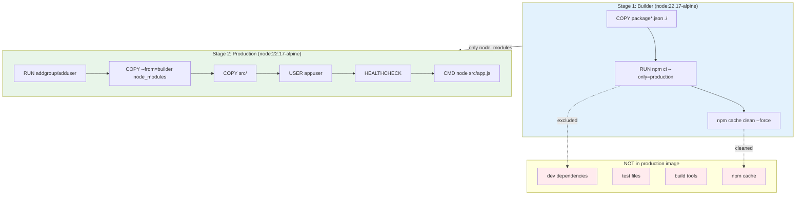
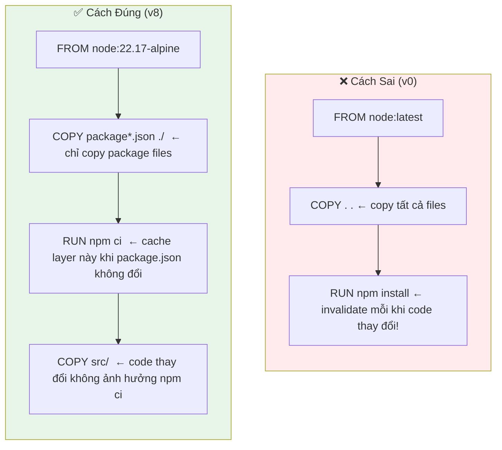
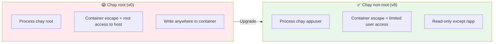
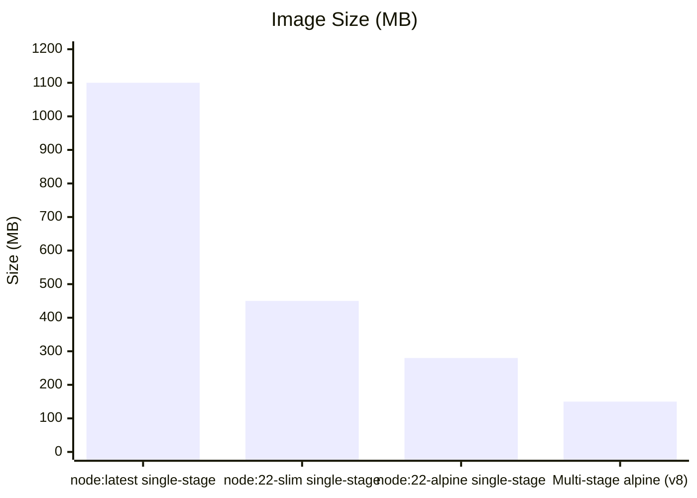

# Docker Best Practices — Từ Bad đến Good

## So sánh: Dockerfile cũ vs mới

| Tiêu chí | v0 (Bad) | v8 (Good) |
|----------|----------|-----------|
| Base image | `node:latest` | `node:22.17-alpine` |
| User | root | appuser (non-root) |
| Stages | Single | Multi-stage |
| Dependencies | npm install (all) | npm ci --only=production |
| Cache | Poor (COPY . . first) | Good (package*.json first) |
| Image size | ~1.1 GB | ~150 MB |
| Health check | None | wget /health |
| .dockerignore | None | Yes |

---

## Multi-stage Build Flow



---

## Docker Layer Caching



### Tại sao thứ tự COPY quan trọng?

Docker cache layer dựa trên:
1. Instruction (FROM, RUN, COPY...)
2. Nội dung files được COPY

Khi `package.json` không thay đổi → layer `RUN npm ci` được cache → build nhanh hơn nhiều.

---

## Security: Non-root User



```dockerfile
# Tạo group và user không có home directory (-S = system user)
RUN addgroup -S appgroup && adduser -S appuser -G appgroup

# Chuyển sang user này cho mọi lệnh tiếp theo
USER appuser
```

---

## Image Size Comparison



---

## .dockerignore — Ngăn Secret Vào Image

Không có `.dockerignore`, lệnh `COPY . .` sẽ copy:

```
❌ node_modules/        (600MB!)
❌ .git/                (git history + secrets)
❌ .env                 (credentials!)
❌ tests/               (không cần trong production)
❌ coverage/            (không cần trong production)
❌ *.secret             (nhạy cảm)
```

Với `.dockerignore`:
```
✅ Chỉ copy src/ và package files
✅ Image nhỏ hơn nhiều
✅ Không rò rỉ secrets vào image
✅ Build nhanh hơn (ít files hơn để upload vào build context)
```
