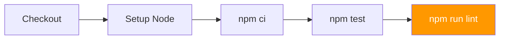
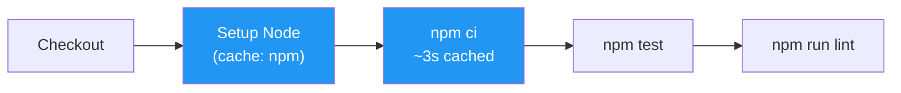
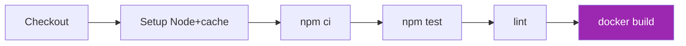
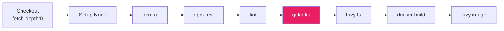
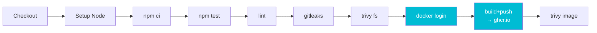
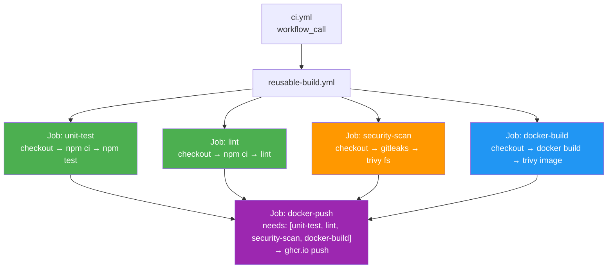

# Pipeline Evolution — Từ v1 đến v12

Mỗi tag thêm một tính năng vào CI pipeline. Diagram dưới đây cho thấy sự phát triển qua từng bài học.

## v1 — Unit Tests

## v3 — Thêm ESLint

## v5 — Thêm Cache

## v6 — Docker Build

## v7 — Trivy Security Scan

## v9 — Gitleaks Secret Scan

## v11 — Push to GHCR

## v12 — Parallel Jobs + Reusable Workflow

## So sánh thời gian (ước tính)

| Version | Jobs | Thời gian ước tính |
|---------|------|-------------------|
| v1 | 1 job sequential | 2 phút |
| v3 | 1 job sequential | 2.5 phút |
| v5 | 1 job (có cache) | 1.5 phút (cached) |
| v7 | 1 job (+ trivy) | 4 phút |
| v9 | 1 job (+ gitleaks) | 5 phút |
| v11 | 1 job (+ push) | 6 phút |
| v12 | 5 jobs parallel | ~4 phút (faster!) |
