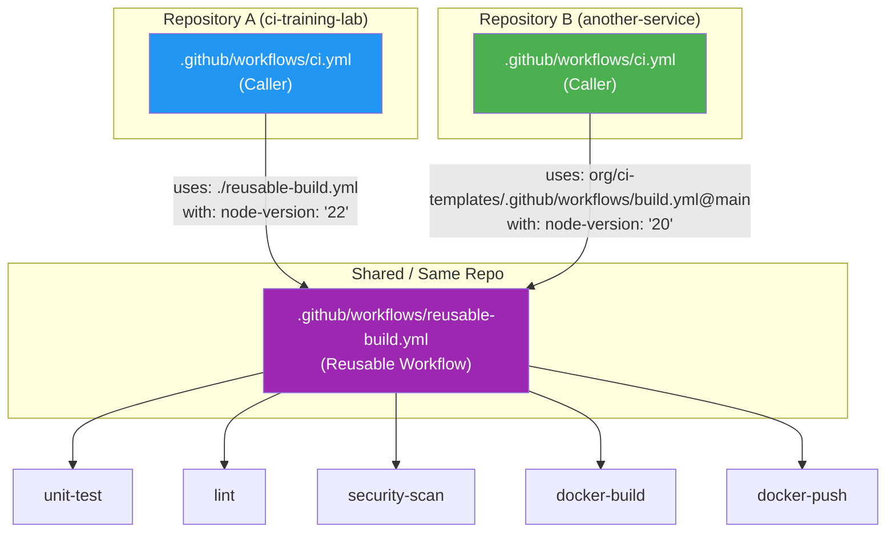
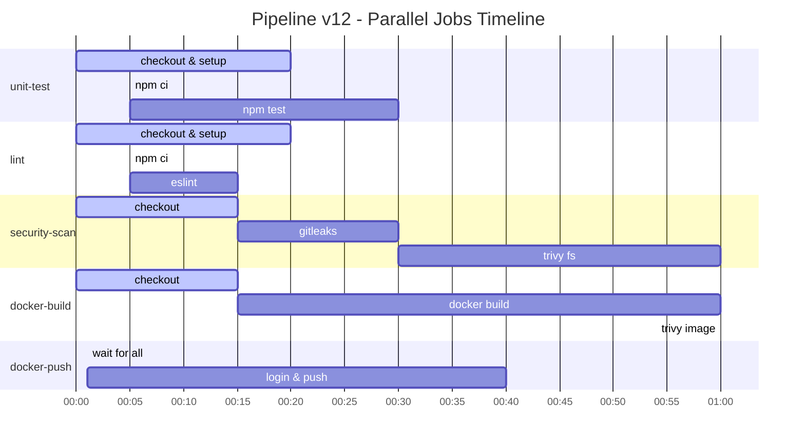
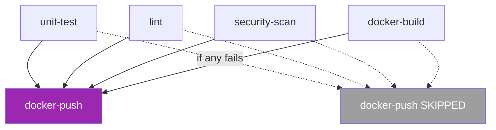
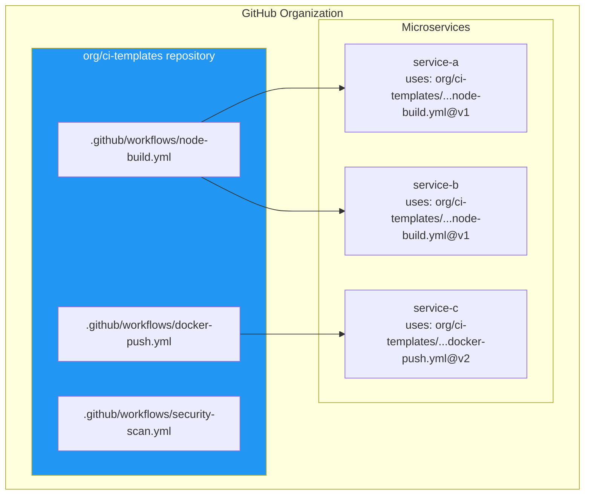

# Reusable Workflows — Kiến Trúc và Thiết Kế

## Tổng quan

Reusable Workflow cho phép định nghĩa CI logic một lần và tái sử dụng ở nhiều nơi.

---

## Kiến trúc: Caller → Reusable



---

## Parallel Jobs Flow



---

## workflow_call Syntax

### Caller (`ci.yml`):

```yaml
jobs:
  pipeline:
    uses: ./.github/workflows/reusable-build.yml
    with:
      node-version: '22'        # ← Input parameter
      image-name: ${{ github.repository }}
    secrets: inherit             # ← Pass all secrets automatically
```

### Reusable (`reusable-build.yml`):

```yaml
on:
  workflow_call:
    inputs:
      node-version:
        description: 'Node.js version'
        required: true
        type: string             # string | boolean | number
      image-name:
        required: true
        type: string

jobs:
  unit-test:
    runs-on: ubuntu-latest
    steps:
      - uses: actions/setup-node@v4
        with:
          node-version: ${{ inputs.node-version }}  # ← Sử dụng input
```

---

## needs — Job Dependencies



```yaml
docker-push:
  needs: [unit-test, lint, security-scan, docker-build]
  if: github.event_name != 'pull_request'
  # Chỉ chạy khi:
  # 1. Tất cả 4 jobs trên PASS
  # 2. Event là push (không phải PR)
```

---

## So sánh: Composite Action vs Reusable Workflow

| Tính năng | Composite Action | Reusable Workflow |
|-----------|-----------------|-------------------|
| Đơn vị | Steps | Jobs |
| Runner | Dùng chung runner của caller | Runner riêng mỗi job |
| Parallel | Không | Có |
| Secrets | Không được truyền trực tiếp | `secrets: inherit` |
| Cách gọi | `uses: ./action` (trong steps) | `uses: ./workflow` (trong jobs) |
| Use case | Nhóm steps hay dùng | Pipeline hoàn chỉnh |

---

## Reusable Workflow ở Organization Level



### Lợi ích:
- **Single source of truth**: Cập nhật security scan 1 lần → áp dụng cho 50 services
- **Governance**: Security team kiểm soát pipeline template
- **Versioning**: Services có thể pin vào `@v1` hoặc theo `@main`
