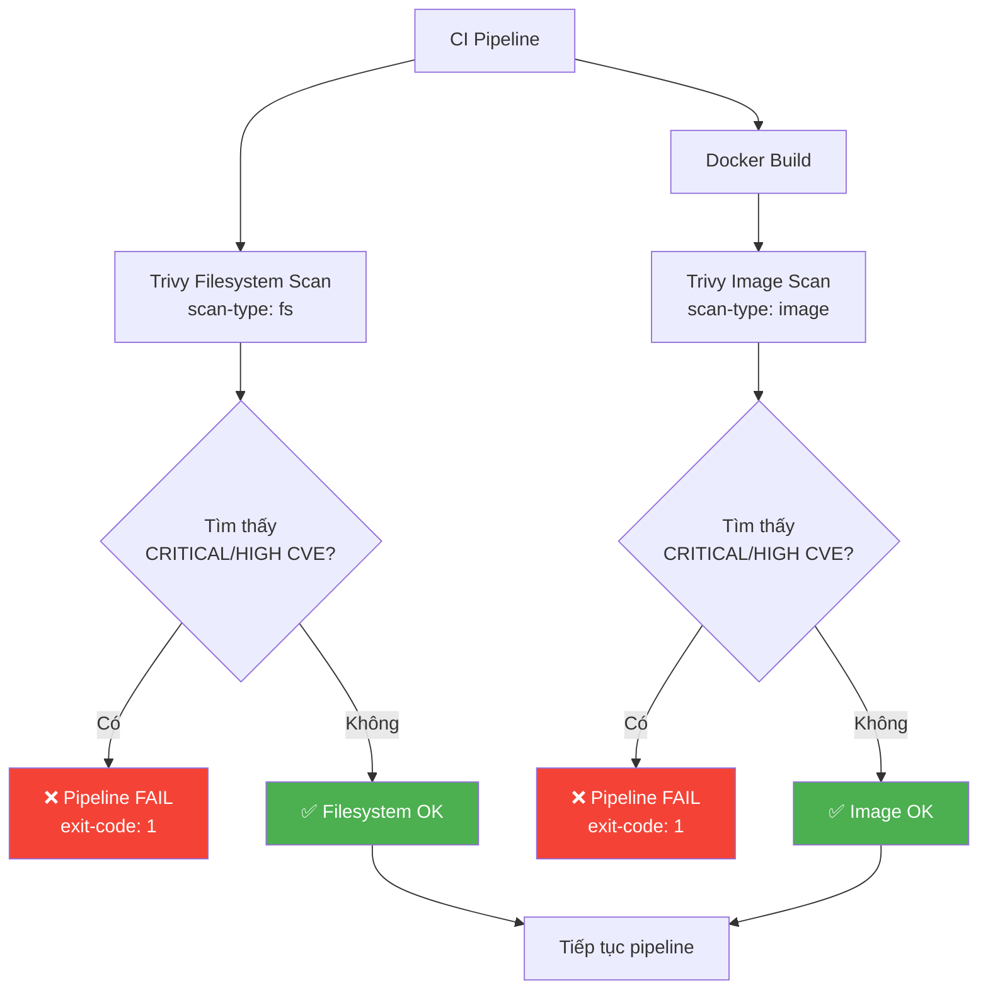
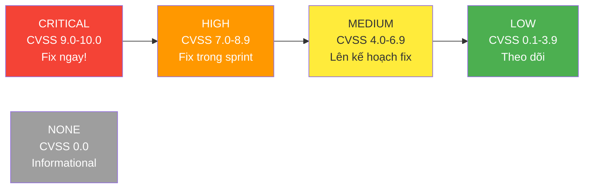
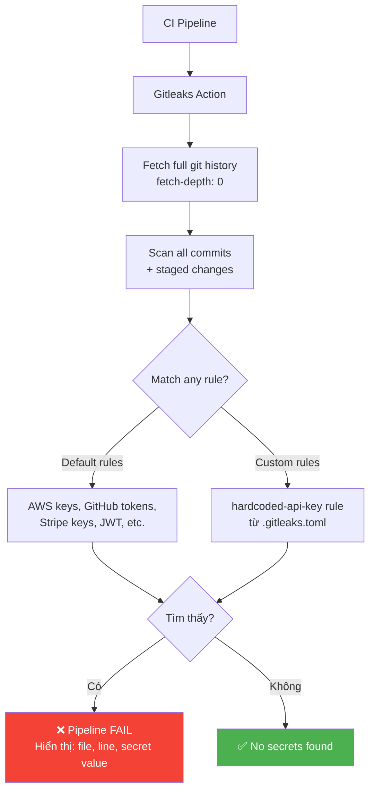
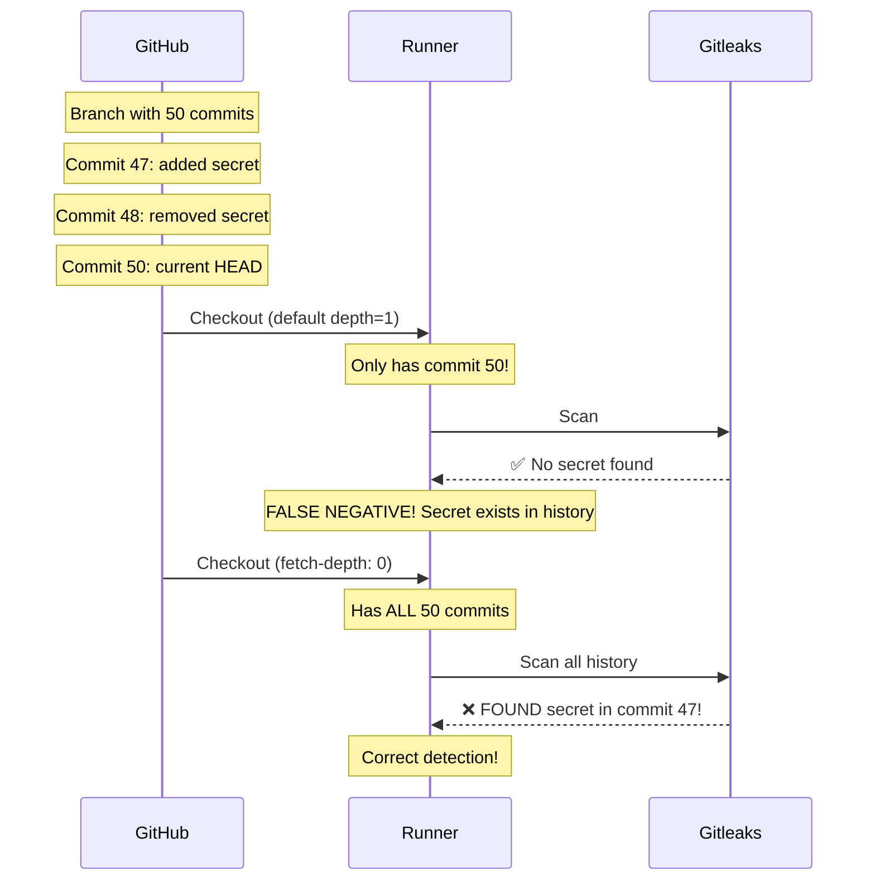
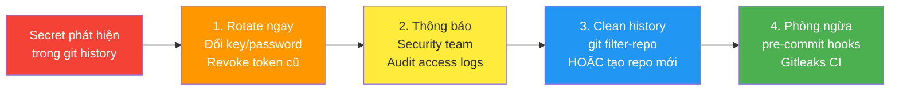

# Security Scanning — Trivy & Gitleaks

## Tổng quan

CI Training Lab sử dụng 2 công cụ bảo mật:

| Tool | Phát hiện | Bài học |
|------|-----------|---------|
| **Trivy** | CVE trong dependencies, Dockerfile issues, OS packages | v7, v8 |
| **Gitleaks** | Hardcoded secrets trong source code và git history | v9, v10 |

---

## Trivy Scan Flow



### Trivy Filesystem Scan

Quét:
- `package.json` / `package-lock.json` — npm vulnerabilities
- `requirements.txt` — Python vulnerabilities
- Go modules, Gemfiles, Composer, v.v.

```yaml
- uses: aquasecurity/trivy-action@master
  with:
    scan-type: 'fs'
    scan-ref: '.'
    format: 'table'
    exit-code: '1'          # Fail pipeline nếu tìm thấy
    severity: 'CRITICAL,HIGH'
```

### Trivy Image Scan

Quét:
- OS packages (alpine, debian, ubuntu)
- Application dependencies trong image
- Dockerfile misconfigurations

```yaml
- uses: aquasecurity/trivy-action@master
  with:
    image-ref: 'ci-training-lab:${{ github.sha }}'
    format: 'table'
    exit-code: '1'
    severity: 'CRITICAL,HIGH'
```

### CVE Severity Levels



---

## Gitleaks Scan Flow



### Custom rule trong .gitleaks.toml

```toml
[[rules]]
id = "hardcoded-api-key"
regex = '''(?i)(api[_-]?key)\s*[=:]\s*["']([^"'\s]{8,})["']'''
secretGroup = 2
```

Pattern này phát hiện:
```javascript
const API_KEY = "sk-training-hardcoded-key..."  // ← Match!
const api_key = "any-long-string-here"           // ← Match!
const API_KEY = "YOUR_KEY_HERE"                  // ← Allowlisted
```

### Vì sao cần `fetch-depth: 0`?



---

## Hành động khi phát hiện secret



> ⚠️ **Quan trọng**: Xoá secret khỏi code và commit lại KHÔNG đủ.  
> Secret vẫn tồn tại trong git history và có thể bị tìm thấy bằng `git log -p`.
